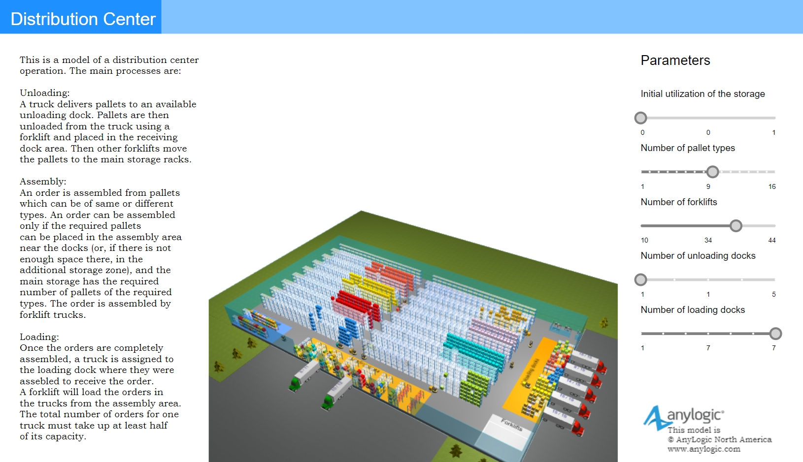
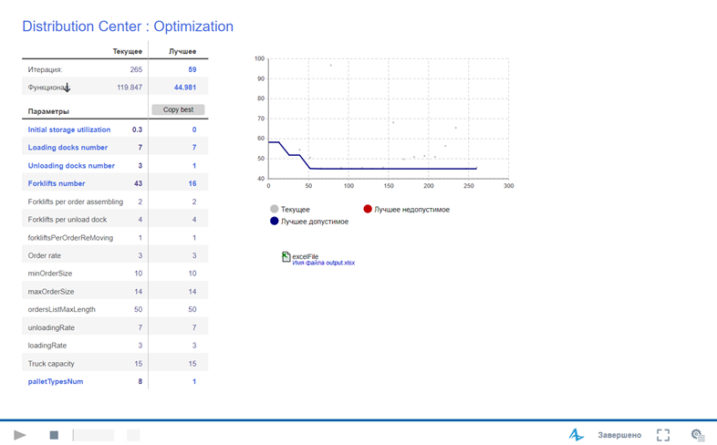
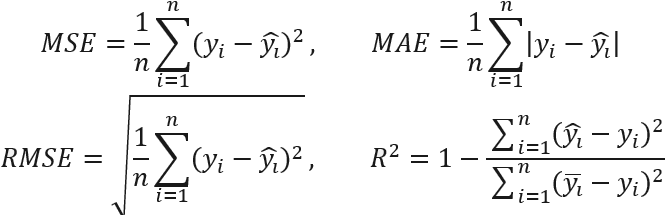
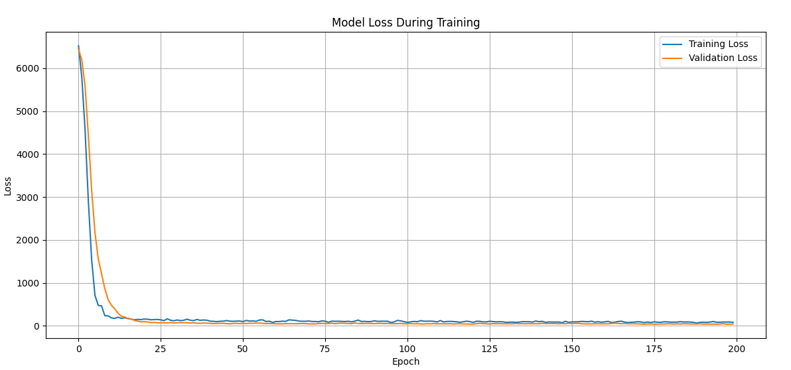
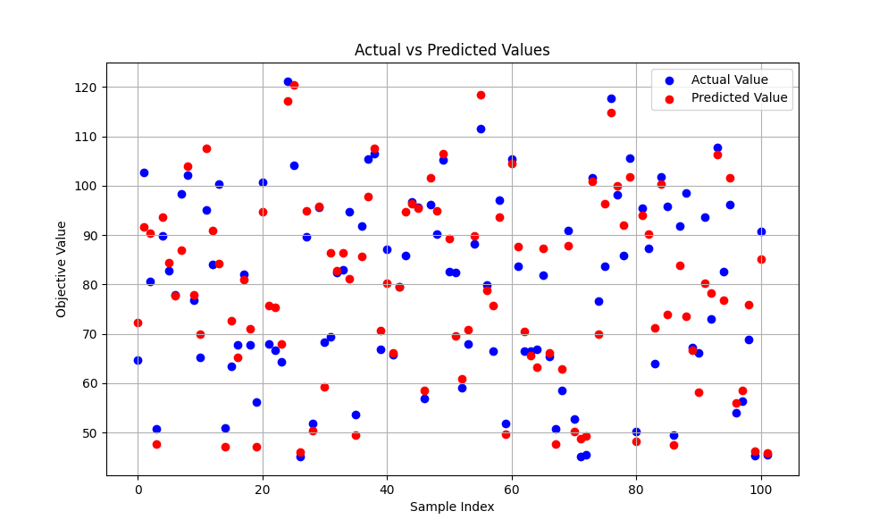

# INTEGRATION OF SIMULATION MODELING AND MACHINE LEARNING FOR DISTRIBUTION CENTER OPTIMIZATION
### Integration of imitation modeling and machine learning to assess the optimality of the initial parameters of the distribution center

------
### This research is dedicated to the development and exploration of the integration of simulation modeling and machine learning methods for optimizing the operations of a distribution center. The main goal of the research is to create an innovative tool that not only optimizes distribution center operations, thereby enhancing its productivity and reducing operational costs but also significantly improves customer service quality. 
### The paper elaborately examines the process of optimizing the distribution center, starting from the selection and detailed study of the simulation model in Anylogic and ending with the data analysis using neural networks. The data obtained from Anylogic were normalized and used to train the neural network, the main goal of which was to predict Objective_value values based on specified parameters. The model was trained and tested on a dataset containing over 500 records with various parameters and corresponding Objective_value values.
### The outcome of the research was the development of a highly accurate neural network capable of predicting Objective_value values for various distribution center parameters, with a determination coefficient r2_score=0.88. The model demonstrated high prediction accuracy, enabling effective evaluation and optimization of distribution center parameters. In-depth analyses and visualization of results were conducted to gain a better understanding of the model's performance.

## Model initialization and training
### The distribution center model was taken from the Anylogic website
### [Anylogic Cloud model](https://cloud.anylogic.com/model/fd24f59d-85cc-45d0-a327-ed551b983c43?mode=SETTINGS)

## Optimization
### Optimization results of the target function (timeLoadTruck). Discrete parameters (blue), fixed (black).

### The optimization results were exported to a csv file

## Python code - machine learning
### We can use the pandas, scikit-learn and tensorflow libraries to analyze data and train an NN that will predict the value of the target variable (Objective Value) based on given parameters (Initial storage utilization, Loading docks number, Unloading docks number, Forklifts number, palletTypesNum). (You can check out `main.py`)

## Results preparation
### Let us evaluate the model and derive the main metrics that determine the success of training and the presence of some error and error.
### MSE (Mean Squared Error) - mean squared error. MSE is calculated as the mean of squares of differences between predicted and actual values.
### MAE (Mean Absolute Error) - Mean Absolute Error. MAE is calculated as the average of the absolute differences between predicted and actual values.
### RMSE (Root Mean Squared Error) - Root Mean Squared Error.
### R² Score (Coefficient of Determination) - coefficient of determination. R² shows the proportion of the variance of the dependent variable that is explained by the model. R² measures how well the model explains the variation in the data. The closer the value of R² is to 1, the better the model's explanatory power.

## Results
### Graph of losses during training. The graph shows that as the epoch increases, the loss decreases and tends to 0. Metrics after training: 
* ### MSE: 50.082402437835135
* ### MAE: 4.940964542463714
* ### RMSE: 7.076892145414902
* ### R^2 Score: 0.8741026529422047

### After training, the model DS_NN_88.h5 was obtained and saved

## Conclusions
### Optimization of distribution center processes based on the use of imitation modeling and agent-based approach in AnyLogic environment can significantly improve its efficiency. The trained NN for predicting the optimization coefficient from the initial parameters showed high accuracy. 

